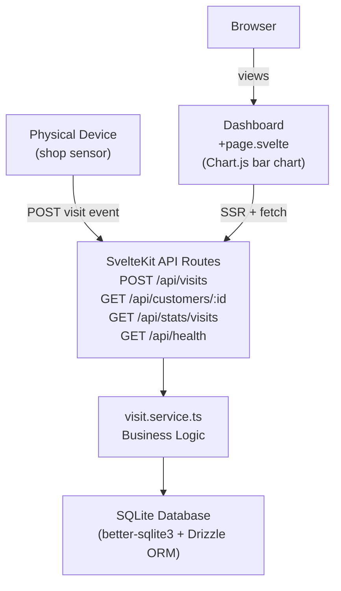

# Tree Nation � X Visits = 1 Tree

A web service that tracks customer shop visits and plants a tree every **X visits**.  
Built with **SvelteKit**, **Tailwind CSS v4**, **SQLite (Drizzle ORM)**, and a **REST API**.

---

## Architecture



---

## How to Run

### Local development

```bash
cd tree-nation
npm install
npm run dev
```

Open http://localhost:5173 for the dashboard.

### Production (Node)

```bash
npm run build
node build
```

### Docker

```bash
docker compose up --build
```

Open http://localhost:3000.  
SQLite data is persisted in the local `./data/` volume.

---

## Configuration

| Env variable        | Default | Description                           |
| ------------------- | ------- | ------------------------------------- |
| `X_VISITS_PER_TREE` | `10`    | How many visits earn one planted tree |
| `PORT`              | `3000`  | Server port (production/Docker only)  |

---

## API Usage

### Record a visit

```bash
curl -X POST http://localhost:3000/api/visits \
  -H "Content-Type: application/json" \
  -d '{"customerId": "card-12345"}'
```

**Response:**

```json
{
  "customerId": "card-12345",
  "totalVisits": 10,
  "treesPlanted": 1,
  "lastConnection": "2026-06-02T10:00:00.000Z"
}
```

### Get customer stats

```bash
curl http://localhost:3000/api/customers/card-12345
```

**Response:**

```json
{
  "customerId": "card-12345",
  "totalVisits": 10,
  "treesPlanted": 1,
  "lastConnection": "2026-06-02T10:00:00.000Z"
}
```

### Get visit stats (all granularities)

```bash
curl http://localhost:3000/api/stats/visits
```

**Response:**

```json
{
  "visitsPerMinute": [{ "time": "2026-06-02T10:00:00Z", "count": 3 }],
  "visitsPerHour": [
    { "time": "2026-06-02T09:00:00Z", "count": 14 },
    { "time": "2026-06-02T10:00:00Z", "count": 7 }
  ],
  "visitsPerDay": [{ "time": "2026-06-02T00:00:00Z", "count": 21 }],
  "visitsPerWeek": [{ "time": "2026-06-01T00:00:00Z", "count": 21 }],
  "visitsPerMonth": [{ "time": "2026-06-01T00:00:00Z", "count": 21 }],
  "totalTrees": 2
}
```

### Health check

```bash
curl http://localhost:3000/api/health
```

---

## Seeding Test Data

Use the seed script to quickly populate the database with visit events for a customer:

```bash
# Default: 10 visits for "test-customer-1" against http://localhost:5173
npm run seed

# Custom number of visits
npm run seed -- --visits=25

# Custom customer ID
npm run seed -- --customer=card-12345

# Custom target URL (e.g. Docker)
npm run seed -- --url=http://localhost:3000

# All options combined
npm run seed -- --visits=50 --customer=card-12345 --url=http://localhost:3000
```

The script prints each visit result and highlights tree milestones. Make sure the dev server (or Docker container) is running before seeding.

---

## Database

Schema is defined in `src/lib/db/schema.ts` using Drizzle ORM. Whenever you change the schema, run:

```bash
# 1. Generate a new migration file (diffs schema vs last snapshot)
npm run db:generate

# 2. Apply the migration to data/db.sqlite
npm run db:migrate
```

Migration files are stored in `src/lib/db/migrations/`. You only need to run these when changing the **database schema** — adding a new endpoint that uses existing tables does not require a migration.

---

## Tests

```bash
npm run test
```

---

## Assumptions

- **Customer identity** is provided by the device. The device sends a `customerId` (e.g. a loyalty card number or NFC tag ID) with every visit event. The service auto-creates a customer record on first visit � no registration step.
- **Visit timestamps** are recorded in UTC ISO 8601 format by the server. The device does not need to send a timestamp.
- **X is configurable** via the `X_VISITS_PER_TREE` environment variable (default: 10). Changing this value after data exists will affect when the next tree milestone is reached but does not retroactively change history.
- The **dashboard is unauthenticated** � it is an open admin view. No login is required.
- The **persistence layer** is SQLite stored in `./data/db.sqlite`. For higher traffic a drop-in swap to PostgreSQL via Drizzle would require minimal code changes.

---

## Technical Decisions

| Decision   | Choice                 | Rationale                                                                                         |
| ---------- | ---------------------- | ------------------------------------------------------------------------------------------------- |
| Framework  | SvelteKit              | Handles API routes and frontend in one project; TypeScript-first; minimal boilerplate             |
| API style  | REST                   | Spec asks to "show API design"; clear for device integration and reviewers                        |
| Database   | SQLite + Drizzle ORM   | Zero setup, file-based, Docker-friendly with a volume mount; Drizzle is lightweight and SQL-close |
| Adapter    | @sveltejs/adapter-node | Needed to run as a real HTTP server in production/Docker                                          |
| Validation | Zod                    | Type-safe boundary validation at API entry points                                                 |
| Charts     | Chart.js               | Lightweight, no framework dependency, dynamic import keeps it off the SSR bundle                  |

---

## Potential Improvements

- **Per-customer chart filter** — add a customer dropdown to filter the bar chart by individual customer, leveraging the existing `GET /api/customers/:id` endpoint.
- **Pagination on customer endpoint** — add a `GET /api/customers` list endpoint with pagination for admin use.
- **Authentication** — protect the dashboard and API with an API key or JWT for production use.
- **PostgreSQL support** — swap SQLite for PostgreSQL via Drizzle with minimal code changes for higher-traffic deployments.
